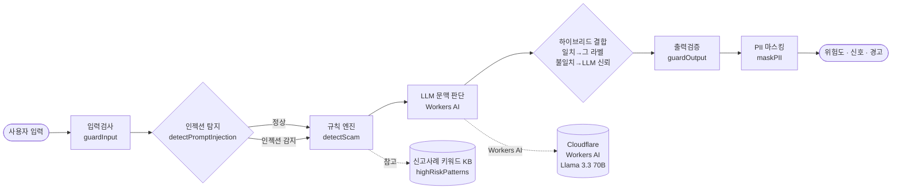
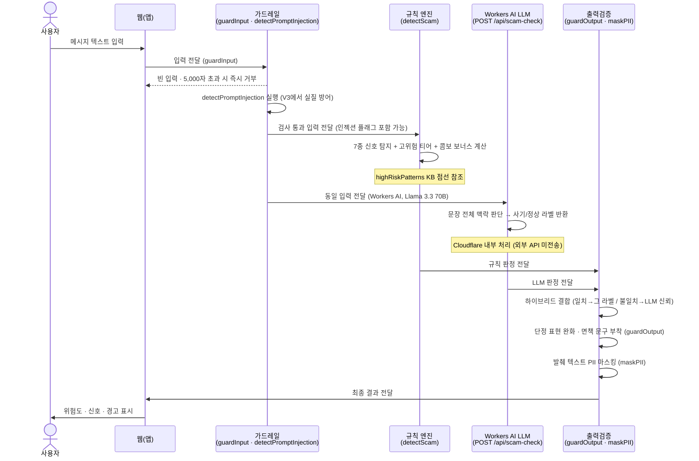

# 데이터 흐름도 (11-dfd.md)

> DAY 11 · AI 사기 메시지 방패 팀 · 담당: 정하린 (UX) · 문서 정리: 콘텐츠 라이터

---

## 흐름도 1 — 전체 파이프라인 (flowchart)

> GitHub에서 이 파일을 열면 위 코드블록이 자동으로 그림으로 표시됩니다.

> V3 하이브리드에서 규칙 엔진(클라이언트)과 LLM(서버)이 함께 실행됩니다. 두 판정이 일치하면 그 라벨을 채택하고, 불일치하면 LLM(문맥 판단)을 신뢰합니다.

---

## 흐름도 2 — 메시지 교환 순서 (sequenceDiagram)

---

## 흐름 설명

V3 하이브리드 파이프라인은 규칙 엔진(클라이언트, 오프라인)과 LLM(Workers AI, 서버)을 함께 실행합니다. 규칙 엔진은 인터넷 없이도 즉시 결과를 냅니다. LLM은 문맥이 중요한 케이스를 보완합니다.

**1단계 — 입력검사 (`guardInput`)**
사용자가 붙여넣은 메시지가 가장 먼저 `guardInput`을 거칩니다. 빈 문자열이거나 공백만 있으면 즉시 거부합니다. 5,000자를 초과하면 5,000자에서 잘라냅니다. 사기 문자는 대부분 짧으므로, 초과 입력은 정상 사용이 아닐 가능성이 높습니다.

**2단계 — 인젝션 탐지 (`detectPromptInjection`)**
"이전 지시를 무시해라", "ignore previous" 같은 패턴이 입력에 포함되어 있으면 경고 플래그를 붙입니다. V3에서 사용자 입력이 LLM으로 전달되므로, 이 탐지 로직은 **실질적인 방어** 역할을 합니다. ADR-0001 때 "V2 LLM 도입 대비 선제 구현"으로 만들어 두었던 것이 V3에서 실제 효력을 발휘합니다.

**3단계 — 규칙 엔진 (`detectScam`) + LLM 문맥 판단 (병행)**
두 판단이 동시에 실행됩니다.

- **규칙 엔진**: 7종 위험 신호(외부 링크 유도·개인정보 수집·긴급성 조성·금전 요구·기관 사칭·당첨 유도·비정상 발신)를 탐지하고 0~100 점수를 계산합니다. `highRiskPatterns` KB(신고 사례 키워드 모음)를 참조해 고위험 키워드에 보너스 점수를 더하고, 두 신호가 동시에 감지되면 콤보 보너스도 추가합니다.
- **Workers AI LLM**: 같은 입력을 `POST /api/scam-check` 엔드포인트로 전달해 Llama 3.3 70B 모델이 문장 전체 맥락을 판단합니다. Cloudflare 내부에서만 처리되며 외부 제3자 API로는 전송되지 않습니다.

**4단계 — 하이브리드 결합**
두 판정 결과를 합칩니다. 규칙 엔진과 LLM이 같은 결론(사기/정상)을 내리면 그 라벨을 채택합니다. 두 결론이 다르면 LLM(문맥 이해)을 신뢰합니다. 이 로직 덕분에 case-h01(지인 사칭 — 규칙 미탐)과 case-h02(드라마 대화 — 규칙 오탐)가 해결됩니다.

**5단계 — 출력검증 (`guardOutput`)**
최종 판정을 사용자에게 보내기 전에 다듬습니다. "100% 사기"처럼 단정적인 표현은 "사기 가능성이 높습니다" 수준으로 완화합니다. 모든 결과 하단에는 고정 면책 문구("이 결과는 참고용입니다. 최종 판단은 사용자 본인이 하며, 확실하지 않을 경우 공식 기관에 확인하세요.")를 자동으로 붙입니다.

**6단계 — PII 마스킹 (`maskPII`)**
결과 발췌 텍스트에 포함된 전화번호·계좌번호·주민등록번호·카드번호 등 개인정보를 가운데 `***`로 치환합니다. 분류 점수는 원본 텍스트로 계산하고, 마스킹은 화면 표시 단계에만 적용합니다. 즉, 마스킹이 탐지 정확도에 영향을 주지 않습니다.

**7단계 — 결과 반환**
위험도 점수, 탐지된 신호 목록, 한 줄 경고 문장이 함께 표시됩니다. `docs/03-scenario.md`의 결정적 순간 정의("숫자와 이유가 함께 보여야 비로소 판단이 일어난다")를 구현한 단계입니다.

---

> 담당: 정하린 (UX) · DAY 11 / 16일 완주 후 V3 하이브리드 갱신
> 관련 파일: `src/guardrails.mjs` / `src/scamDetector.mjs` / `docs/10-guardrails.md` / `docs/09-adr-0001.md` / `docs/17-adr-0002.md`
