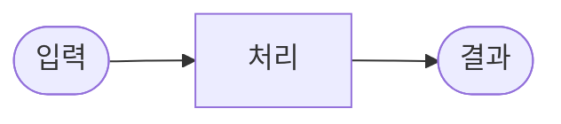

# 그림으로 보고, 남에게 보여주기 — 아키텍처와 중간 데모 (데모 팀 DAY11~12 실전)

> DAY 11~12 교육자료 · AI 사기 메시지 방패 팀 · 작성: 콘텐츠 라이터

---

## 1. Mermaid란 무엇인가

도표를 그리는 방법에는 두 가지가 있습니다. 하나는 파워포인트나 피그마 같은 편집 도구로 도형을 하나하나 배치하는 방법이고, 다른 하나는 **텍스트를 적으면 자동으로 도표가 그려지는** Mermaid를 쓰는 방법입니다.

Mermaid로 작성한 도표는 이미지 파일이 아니라 텍스트 코드입니다. 덕분에 **Git으로 버전 관리**할 수 있고, 누가 언제 어떤 부분을 바꿨는지 히스토리가 남습니다. PPT 파일을 슬랙에 올리고 이메일로 보내는 번거로움도 없습니다. GitHub에서 Markdown 파일을 열면 Mermaid 코드블록을 자동으로 그림으로 보여줍니다.

위 세 줄을 Markdown 파일에 넣으면 화살표로 연결된 흐름도가 바로 나타납니다. 도표도 코드처럼 짧게 고치고, 커밋하고, 팀원과 공유합니다.

**핵심 요약**: Mermaid는 텍스트로 그리는 그림입니다. Git으로 관리할 수 있어서 문서와 코드가 함께 움직입니다.

---

## 2. DFD와 시퀀스 다이어그램의 차이

DAY11에 우리 팀은 두 종류의 다이어그램을 작성했습니다. 둘 다 시스템의 동작을 표현하지만, 보는 관점이 다릅니다.

| 구분 | DFD (데이터 흐름도) | 시퀀스 다이어그램 |
|------|---------------------|-----------------|
| 무엇을 보여주나 | 데이터가 어디서 들어와 어디로 흐르는지 | 누가 누구에게 어떤 순서로 메시지를 보내는지 |
| 비유 | 공장의 컨베이어벨트 위에 상자가 어떤 기계를 거쳐 나오는지 | 전화 통화에서 누가 먼저 말하고 누가 답하는지 |
| 용도 | "이 시스템에서 데이터가 어떻게 처리되는가"를 한눈에 설명 | "A가 B에게 요청하면 B가 C에게 전달하고..." 순서를 명확히 전달 |
| 우리 팀 산출물 | `docs/11-dfd.md` — flowchart 섹션 | `docs/11-dfd.md` — sequenceDiagram 섹션 |

복잡한 시스템을 처음 설명할 때는 DFD가 전체 그림을 주고, 시퀀스 다이어그램이 단계별 흐름을 보충합니다. 둘을 함께 쓰면 "전체 구조"와 "순서"를 모두 전달할 수 있습니다.

---

## 3. 중간 데모를 '일찍, 자주' 하는 이유

프로젝트가 거의 끝난 뒤에 처음으로 사용자에게 보여주는 팀이 있습니다. 이 방식의 문제는 피드백을 반영할 시간이 없다는 것입니다. 마지막에 "이 방향이 틀렸네요"라는 말을 들으면 고칠 수가 없습니다.

중간 데모는 다릅니다. 완성되지 않은 버전을 일부러 일찍 보여주고, 틀린 방향을 빨리 찾습니다. DAY 12에 발견한 문제는 DAY 13에 고칠 수 있습니다. DAY 15에 발견한 문제는 고칠 시간이 없습니다.

우리 팀의 원칙은 DAY 5에 이미 정해져 있었습니다. "일단 내놔야 어디가 틀렸는지 빨리 알 수 있다"(박서준, DAY5 의견 조율). CLI로 먼저 조기 시연한 이유이고, DAY 12 중간 데모를 계획에 넣어둔 이유입니다.

**비유**: 보고서를 다 쓰고 나서 제출하는 것과, 개요를 작성한 뒤 교수님께 방향이 맞는지 먼저 확인받는 것의 차이입니다. 전자는 방향이 틀리면 처음부터 다시 써야 합니다.

---

## 4. 피드백은 '수용'보다 '반영'이 중요

피드백을 받을 때 두 가지 태도가 있습니다. 하나는 "알겠습니다, 다 반영하겠습니다"라고 말하고 흐지부지 넘기는 것입니다. 다른 하나는 받은 피드백을 하나하나 목록으로 만들고, 반영 여부와 반영 방법을 명시하는 것입니다.

수용은 "네"라고 말하는 것입니다. 반영은 실제로 문서와 코드가 바뀌는 것입니다.

우리 팀은 `docs/12-feedback.md`에 피드백 표를 만들어 다음을 명시했습니다.

- 피드백 내용 (받은 그대로)
- 중요도 (높음 / 중간 / 낮음)
- 반영 여부 (반영 예정 / 검토 중 / 유보)
- 반영 문서 (어디에 어떻게 반영할지)

이렇게 하면 팀원 모두가 "이 피드백이 어디로 갔는지"를 추적할 수 있습니다. 피드백이 공중에 떠돌지 않고 문서로 내려앉습니다.

**핵심**: 피드백을 항목으로 만들지 않으면 기억에서 사라집니다. 반드시 목록으로 옮기고, 반영 문서를 지정하세요.

---

## 5. 우리 팀 실제 피드백 4건과 반영 계획

DAY 12에 초기 테스터 김지우 외 2명에게 V2 CLI를 시연하고 아래 4건의 피드백을 받았습니다. 전체 표는 `docs/12-feedback.md`에서 확인할 수 있습니다.

**피드백 1 — "위험은 알겠는데 그래서 어떻게 해야 하나가 안 나와요" (중요도: 높음)**

결과 화면이 위험도 점수와 신호를 보여주지만, "링크를 누르지 마세요", "112에 신고하세요" 같은 다음 행동이 없었습니다. 테스터는 판단은 했지만 행동 방향을 몰랐습니다. 반영 계획: PRD v2에 행동 안내 한 줄 추가를 필수 기능으로 등록하고 DAY 13에 갱신합니다.

**피드백 2 — "정상 문자인데 경고가 떴어요, 드라마 대화류 오탐" (중요도: 높음)**

테스터가 드라마 감상 대화(경찰·영장·체포 단어 포함)를 넣었더니 위험으로 잡혔습니다. `docs/08-model-compare.md`의 case-h02와 같은 유형입니다. 규칙 기반 엔진이 맥락을 이해하지 못하는 구조적 한계입니다. 반영 계획: 오탐 가능성을 TRD v2에 한계로 명시하고, 화면에 짧은 안내 문구를 추가합니다.

**피드백 3 — "결과가 한눈에 안 들어와요, 색 강조가 있으면 좋겠어요" (중요도: 중간)**

위험/정상 구분을 색으로 시각화해 달라는 요청입니다. DAY 14 웹 UI 단계에서 정하린(UX)이 담당합니다.

**피드백 4 — "예시 체험 버튼이 있으면 처음 이해하기 쉽겠어요" (중요도: 낮음)**

DAY 4 PRD v1에서 이미 선택 기능으로 등록된 항목입니다. 일정 여유가 생기면 추가합니다.

이 4건의 피드백 중 중요도 높음 2건은 DAY 13에 반드시 반영합니다. 중간 데모를 한 번 했는데 문서와 코드가 두 군데 개선됩니다. 이것이 '일찍 보여주는 이유'입니다.

---

> 담당: 콘텐츠 라이터 · DAY 11~12
> 관련 파일: `docs/11-dfd.md` / `docs/12-feedback.md` / `docs/08-model-compare.md` / `docs/10-guardrails.md`
